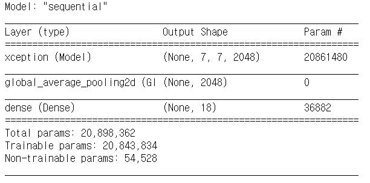
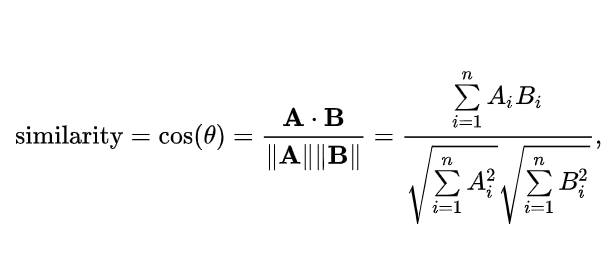

# ML Model

1. [분실물 이미지 카테고리 분류 모델](#1.-분실물-이미지-카테고리-분류-모델)
2. [분실물 이미지 색상 검출 모델](#2.-분실물-이미지-색상-검출-모델)
3. [유사한 이미지 검색 모델](#3.-유사한-이미지-검색-모델)

## 개발 환경 (공통)

- Anaconda 4.8.3

- Python 3.7.7

- 머신 러닝 라이브러리

  - Numpy 1.18.1

  - Scipy 1.4.1

  - Scikit-learn 0.22.1

- 딥 러닝 프레임워크

  - tensorflow-gpu 2.0.0

  - Keras 2.3.1

- 전체 라이브러리는 `AI.yaml` 참고 (OS: Window)

## 1. 분실물 이미지 카테고리 분류 모델

### 배경 지식 (Model)

- Deep learning

- [CNN](./doc/CNN.md)

- 다중 이미지 분류 모델

  - [tensorflow fashion mnist](https://www.tensorflow.org/tutorials/keras/classification?hl=ko)

  - [당근마켓](https://medium.com/daangn/이미지만으로-내-중고물품의-카테고리를-분류해준면-feat-keras-b86e5f286c71)

### 데이터셋

- Selenium 이용하여 크롤링

cf. [훈련셋, 검증셋, 시험셋](https://tykimos.github.io/2017/03/25/Dataset_and_Fit_Talk/)

- train : test 를 8 : 2 로 split
- train : validation 을 9 : 1 로 split
- label - 총 18개
  train set (Found 6001 images belonging to 18 classes)

| Category   | 증강 전 | 증강 후 |
| ---------- | ------- | ------- |
| 가방       | 702     | -       |
| 귀금속     | 245     | 726     |
| 도서용품   | 35      | 377     |
| 산업용품   | 15      | 357     |
| 서류       | 31      | 615     |
| 쇼핑백     | 473     | -       |
| 스포츠용품 | 13      | 348     |
| 악기       | 2       | 390     |
| 유가증권   | 46      | 411     |
| 의류       | 505     | -       |
| 자동차용품 | 130     | 507     |
| 전자기기   | 324     | 954     |
| 증명서     | 43      | 382     |
| 지갑       | 1902    | -       |
| 카드       | 419     | 0       |
| 컴퓨터     | 51      | 403     |
| 현금       | 167     | 497     |
| 휴대폰     | 898     | -       |

- 카테고리 평균 333개 데이터

  - 333개보다 적은 카테고리는 데이터를 증강

- 데이터 증강

  - `ImageDataGenerator` 클래스를 이용해 데이터를 증강
  - train dataset/[label]/ 구조로 데이터를 증강 후 정리

  ```python
  import os
  from  tensorflow.python.keras.preprocessing.image import ImageDataGenerator, array_to_img, img_to_array, load_img

  datagen = ImageDataGenerator(
          rescale=1./255,
          rotation_range=40,
          width_shift_range=0.2,
          height_shift_range=0.2,
          shear_range=0.2,
          zoom_range=0.2,
          horizontal_flip=True,
          fill_mode='nearest')
  ```

  - rotation : 지정된 각도 범위내에서 원본이미지 회전

  - width_shift_range : 지정된 범위내에서 수평방향 이동

  - height_shift_range : 지정된 범위내에서 수직방향 이동

  - zoom_range : 지정된 범위 내에서

  - horizontal_flip : 수평 방향 뒤집기

  ```python
  for name in os.walk(train_dir).__next__()[1]:
      now_path = os.path.join(train_dir, name)
      a = os.walk(now_path).__next__()
      if len(a[2])-333 < 0:
        myiter = abs((len(a[2])-333)//len(a[2]))
        mypath = os.walk(os.path.join(train_dir, name)).__next__()[0]
        filenames = os.walk(os.path.join(train_dir, name)).__next__()[2]
        for fn in filenames:
          img = load_img(os.path.join(mypath, fn))
          x = img_to_array(img)
          x = x.reshape((1,) + x.shape)
          i = 0
          for batch in datagen.flow(x, batch_size=1, save_to_dir=mypath, save_prefix=f'DA{i}', save_format='jpg'):
            i += 1
            if i > myiter:
                break
  ```

### 학습

#### Hyperparameter

- learing_rate : 0.0001

- batch_size : 32

- validation_split : 0.9

- epoch : 10

#### Model

- ImageNet으로 미리 학습된 이미지 분류모델(Xception)을, [당근마켓](https://medium.com/daangn/이미지만으로-내-중고물품의-카테고리를-분류해준면-feat-keras-b86e5f286c71) 코드를 참고해서 _Fine-tuning_ 해 모델을 분실물 데이터에 맞게 업데이트 한다.

- 모델 및 Params의 값을 다음과 같다.

  

##### Loss

- `categorical_crossentropy`
- 다중 분류의 경우 Loss 계산 시 `Cross Entropy` 의 한 종류인 `categorical_crossentropy` 를 사용한다.

##### Optimizer

- `Adam Optimizer`

##### Train

- 사용자에게 적절한 카테고리 추천을 위해 오류 지표는 `상위 1개 정확도`와 `상위 3개 정확도`를 사용한다.

- 제공된 `gpu-machine` 을 이용하여 학습한다.

  - [Python 백그라운드 실행](./doc/Python백그라운드.md)

### 결과

- `model.metrics_names`

  |                      | 데이터 증강 전     | 데이터 증강 후     |
  | -------------------- | ------------------ | ------------------ |
  | loss                 | 1.4511728533147055 | 1.4020797656483628 |
  | categorical_accuracy | 0.7465278          | 0.6423611          |
  | top_3_accuracy       | 0.8923611          | 0.8645833          |

## 2. 분실물 이미지 색상 검출 모델

### 라이브러리

- python-firebase 1.2

  - https://stackoverflow.com/questions/54691763/unable-to-connect-firebase-using-python-3-72
    1. cmd 에서 `python -m pip show python-firebase` 입력
    2. Location 위치로 이동하여 파일명 `async.py` 이름 `nasync.py` 로 변경
    3. `__init__.py` , `firebase.py` 파일에서 `from .nasync import process_pool` 로 변경

- opencv-contrib-python 4.2.0.34

### 배경 지식

- [텐서플로우 색 인식 테스트](https://webnautes.tistory.com/1256)

### 데이터셋

- [TheCodingTrain의 파이어베이스 DB에 공개](https://www.youtube.com/playlist?list=PLRqwX-V7Uu6bmMRCIoTi72aNWHo7epX4L) ...

- label

  - "red-ish",

  - "green-ish",

  - "blue-ish",

  - "orange-ish",

  - "yellow-ish",

  - "pink-ish",

  - "purple-ish",

  - "brown-ish",

  - "grey-ish"

### 학습

#### Hyperparameter

- learning_rate : 0.001

- batch_size : 32

- train size, validation size : 58856, 7357

- epoch : 15

#### model

```
# Sequential model
_________________________________________________________________
Layer (type)                 Output Shape              Param #
=================================================================
dense (Dense)                (None, 64)                256
_________________________________________________________________
dense_1 (Dense)              (None, 9)                 585
=================================================================
Total params: 841
Trainable params: 841
Non-trainable params: 0
_________________________________________________________________
```

```python
activation func: relu # - relu 함수는 sigmoid, tanh 함수와 비교할 때 학습 속도가 훨씬 빠름
Loss : categorical_crossentropy
optimizer : Adam Optimizer
```

### 결과

- batch_size = 32 Accuracy: 0.7735490009514748
- batch_size = 64 Accuracy: 0.7697431018078021

## 3. 유사한 이미지 검색 모델

### 라이브러리

- [scipy-1.4.1](https://pypi.org/project/scipy/)

- [mahotas-1.4.9](https://pypi.org/project/mahotas/)

  - ([Visual Studio C++ build tools](https://visualstudio.microsoft.com/ko/visual-cpp-build-tools/?rr=https%3A%2F%2Fwww.google.com%2F))

  - mahotas 는 OpenCV 가 제공하지 않는 최신 알고리즘 제공함

- [sklearn-0.22.2.post1](https://pypi.org/project/scikit-learn/)

### 배경 지식

- 딥 러닝 X, 이미지 프로세싱 후 직접 이미지 유사도 측정

- [mahotas를 이용한 유사 이미지 찾기](https://pinkwink.kr/1173)

- [cosine similarity](https://velog.io/@crescent702/cos-similarity)

### 데이터

- 서비스에서 사용자가 게시한 이미지 데이터 활용 (n개)

  - 분실자 이미지 1개 + 습득물 관리센터 이미지 n-1 개

### 이미지 유사도 측정 과정

#### feature 추출

- 이미지의 2차원 feature 추출 알고리즘 중 하나인 `haralick` 사용

- feature 추출 후 로지스틱 회귀 분류기 사용

- LOOCV(leave-one-out-cross-validation) 사용하여 학습과 평가 수행

  - 데이터 1개를 validation set 으로, 나머지 n-1개 데이터를 training set 으로 셋팅 후 모델에 fit 하는 과정 의미
  - 자료가 n개인 경우 LOOCV 과정을 n번 반복하여 평균을 냄
  
- feature 로 이미지 간 거리 도출

#### 코사인 유사도 거리 계산

- scipy 라이브러리 활용



- 코사인 유사도는 벡터의 크기가 중요하지 않을 때 성능을 발휘

- ```python
  dists = distance.squareform(distance.pdist(features))
  ```

  - `pdist()`메서드를 사용하여 2x2 행렬 구함
- dists의 i 행, j 열 : i번째 이미지와 j번째 이미지의 유사도 (거리)
  
- 대각 원소들은 자기 자신과의 거리를 의미하므로 0
  
- `pdist` 의 default 는 *euclidean* 

  - `pdist(features, 'cosine')` 으로 유사도 측정법을 지정하여 계산

### 결과

- 사용하는 이미지 데이터에 따라 결과 상이함
