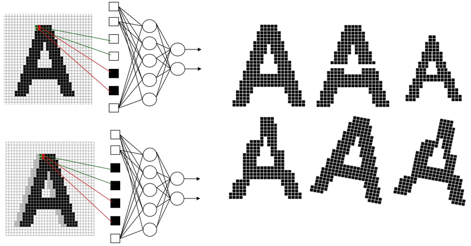

# CNN (Convolutional Neural Networks)



- 일반 신경망은 이미지 데이터를 하나의 데이터로 처리하기 때문에 위치가 달라지거나 왜곡된 경우 성능이 좋지않다.
- 이를 보완하기 위해 이미지에서 Convolution 연산을 이용해 Feature 값을 얻는다.


## CNN의 구조 

cnn은 크게 아래 세 단계로 나눌 수 있다. 

1. Feature Extraction 

   - Stride

     필터는 한번에 지정한 Stride만큼 이동함

2. Shift and distorgion invariance 

   - Padding

     입출력의 크기를 맞추고, 모서리 정보를 네트워크에 알려줌

   - Pooling Layer

     [과적합](https://mc.ai/cnn에서-pooling이란/)을 해결을 위해 넣어줌.

     일반적으로 feature 수가 많아질 수록 과적합의 우려가 커짐

3. Classification


## 모델 저장 후 로드해서 사용하기 

```python
from tensorflow.keras.models import load_model

# 모델 저장하기 
model.save('test.h5')

# 모델 불러오기 
model = load_model('test.h5')

# 모델 사용하기 
xhat = pilimg.open('testdata.PNG').convert('L')
resized_image = np.array(xhat.resize((28, 28)))
x = np.expand_dims(resized_image, axis=0)
yhat = model.predict(x)
```


확장자는 `h5`로 저장되며, 학습 중 weight 만 저장할 수도 있다. [참고](https://tykimos.github.io/2017/06/10/Model_Save_Load/)


참고하면 좋은 링크 

[뉴런부터 YOLO까지](https://www.youtube.com/watch?v=KoZK6QYZgwM&t=4s)

